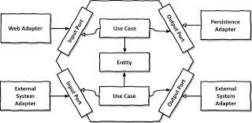

# Clean Architecture Discord AI Bot

Discord AI Bot 是一個強大的機器學習模型互動工具，它允許 Discord 服務器的成員透過簡單的命令與 ChatGPT、Gemini 等 AI 模型進行互動。此 bot 特別適合於需要快速訪問這些模型以回答問題、生成內容或進行特定任務的社群。

## 功能與指令

### 管理員功能

- 查詢系統開銷：可以查詢所有服務器中所有成員的當月使用情況。  
  命令：  
  `/querySystemCurrentMonthUsage`

- 查詢服務器開銷：可以查詢服務器內所有成員的當月使用情況。  
  命令：  
  `/queryServerCurrentMonthUsage`

- 查詢系統開銷：可以查詢所有服務器中所有成員的歷史使用情況。  
  命令：  
  `/querySystemHistoryUsage`

- 查詢服務器開銷：可以查詢服務器內所有成員的歷史使用情況。  
  命令：  
  `/queryServerHistoryUsage`

- 設定公告區：可以設定一個公告區域，用於發布重要訊息。  
  命令：  
  `/setAnnouncementArea`

- 設定開銷上限：可以設定每個成員的當月開銷上限。  
  命令：  
  `/setExpenseLimit [用戶名稱] [上限金額]`

- 設定記憶長度：可以設定每個對話記憶長度  
  命令：  
  `/setMemoryLimit [用戶名稱] [上限金額]`

- 開銷報告：在每個月的第一天，bot 會自動計算並報告該服務器內每個成員的開銷情況。

### 用戶功能

- 模型切換：用戶可以透過指令輕鬆切換當前互動的 AI 模型。  
  命令：  
  `/switchModel [模型名稱]`

- 查詢使用者資訊：用戶可以查詢自己的詳細資訊。
  命令：  
  `/info`

- 開啟一個新的對話，並進行互動。  
  命令：  
  `/newChat`

- 繼續上一次的對話，並進行互動。  
  命令：  
  `/chat`

- 設定持久性提示詞  
  命令：  
  `/setPrompt [提示詞]`

## 程式架構

遵循六角形架構，分為以下幾個部分：

- Adapter：負責處理與外部系統的通信，包括處理 HTTP 請求、處理 Discord 事件等。

  - In
  - Out

- Application：負責處理業務邏輯，包括處理用戶請求、處理 AI 模型的輸入與輸出等。

  - Domain

    - Model
    - Service

  - Port
    - In
    - Out
